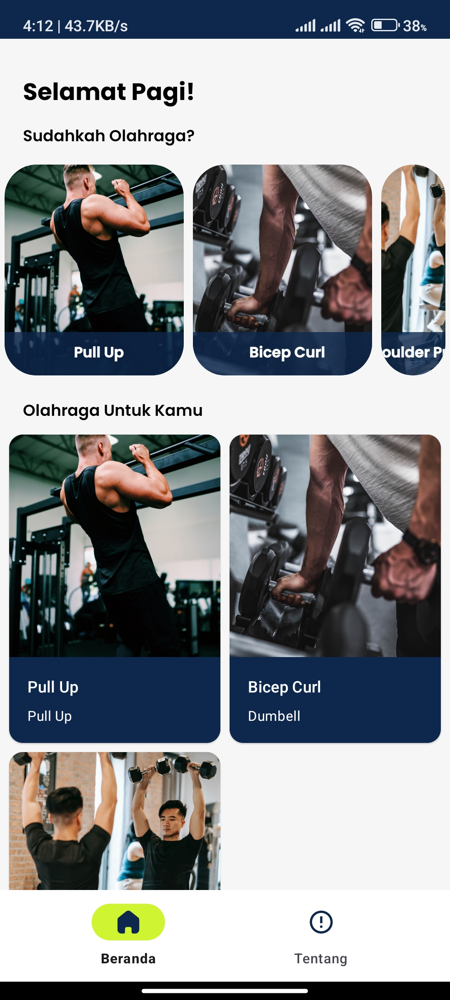
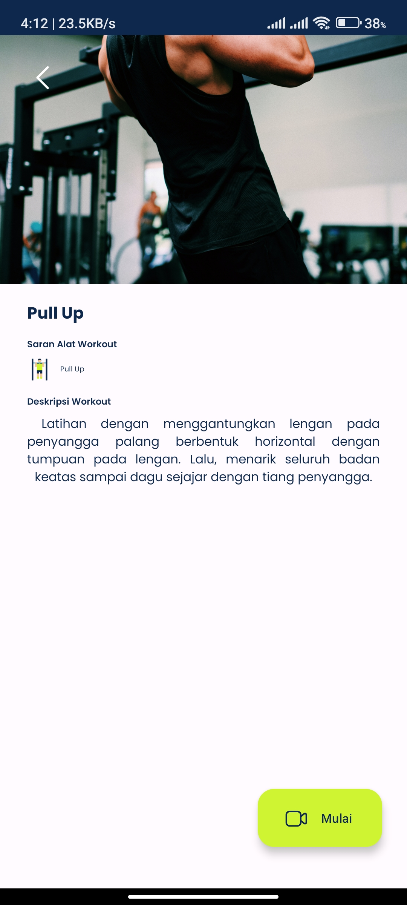
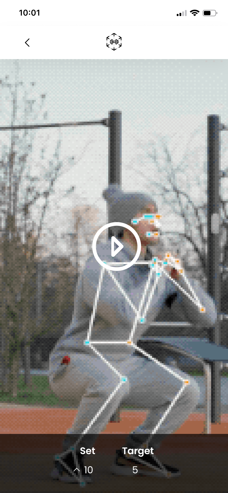

# PELATIH OLAHRAGA VIRTUAL BERBASIS AUGMENTED REALITY MENGGUNAKAN BODY TRACKING

Pelatih olahraga virtual berbasis Augmented Reality dengan menggunakan body tracking, membantu pengguna ketika melakukan olahraga tanpa adanya pelatih dengan menggunakan body tracking. Aplikasi ini dinamai dengan ARFI yaitu Augmented Reality Fitness, Aplikasi ARFI menggunakan kamera handphone untuk mendeteksi body tracking kepada pengguna ketika berolahraga. ARFI memiliki target pengguna yang ingin melakukan fitness. Fitur utama yang disediakan Fitur Fitness dengan Augmented Reality menggunakan body tracking, dan fitur program Fitness.

[//]: # (| Tampilan Utama                               | Tampilan Detail Workout                      | Tampilan Kamera                              |)

[//]: # (|----------------------------------------------|----------------------------------------------|----------------------------------------------|)

[//]: # (|  |  |  |)
